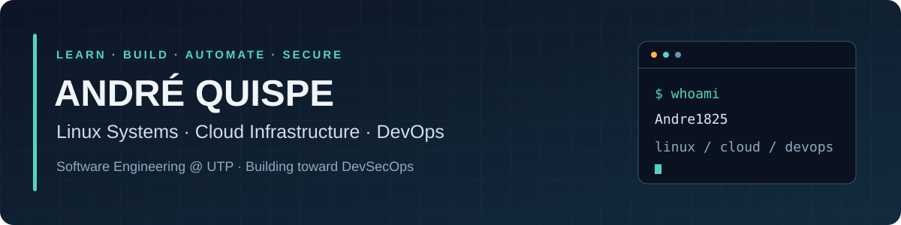

  

  
  
  

## 👋 About me

I'm **André**, a **Software Engineering student at the Technological University of Peru (UTP)**, currently in my **7th semester**. My growing focus is **Linux systems administration, cloud infrastructure and DevOps**, with the goal of progressively specializing in **DevSecOps**.

Through academic and personal projects, I've gained hands-on experience with Linux, Docker, networking, AWS, Java, Spring Boot, and relational and non-relational databases. I've also worked with full-stack application environments, containerization and cloud deployment.

- 🐧 **Current focus:** Linux administration, troubleshooting and networking fundamentals.
- ☁️ **Building toward:** reliable cloud infrastructure, automation and secure containerized environments.
- 📚 **Currently preparing for:** RHCSA and AWS Certified Solutions Architect – Associate (SAA).
- ⚙️ **Continuing to learn:** Kubernetes, cloud architecture and infrastructure security.
- 🌱 **How I work:** proactive, self-taught, and committed to continuous learning through hands-on practice.

> My goal is to build, operate, automate and secure reliable, scalable and efficient technology environments.

## 🛠️ Technologies & tools

  
  
  
  
  
  
  
  
  

## 🎓 Certifications & training

### Earned certifications

  
  

### Completed training

- **Cisco Networking Academy:** Introduction to Networks; Switching, Routing, and Wireless Essentials.
- **Specialized training:** Linux, Docker and Spring Boot.

## 🚀 Selected projects

Academic and personal work that connects application development with deployment and operational fundamentals.

| Project | What it demonstrates | Technologies |
| --- | --- | --- |
| [**TechStore**](https://github.com/Andre1825/TechStore) | Inventory management with stock movements, role-based access and a PostgreSQL environment in Docker. | Java · Spring Boot · React · PostgreSQL · Docker |
| [**SmartStock360**](https://github.com/Andre1825/SmartStock360) | Demand prediction with a React → Spring Boot → FastAPI architecture and Docker images for backend services. | React · Java · Spring Boot · Python · FastAPI · Docker |
| [**IT Help Desk**](https://github.com/Andre1825/Sistema-de-Mesa-de-Ayuda-con-React) | Technical incident tracking with forms, filters, status management and a simulated REST API. | React · Vite · Axios · json-server |

  <a href="https://github.com/Andre1825?tab=repositories">View all public repositories →</a>

---

<strong>Learning by building. Growing through practice.</strong> Linux · Cloud · DevOps · Infrastructure Security

